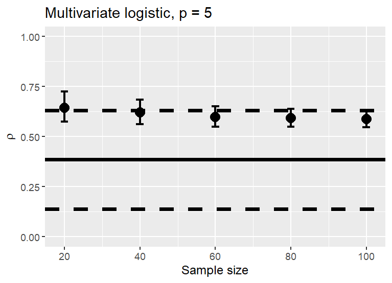
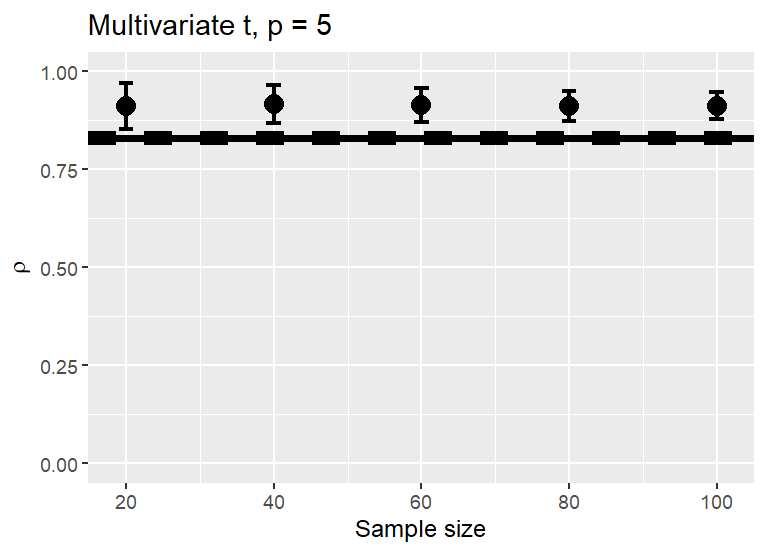
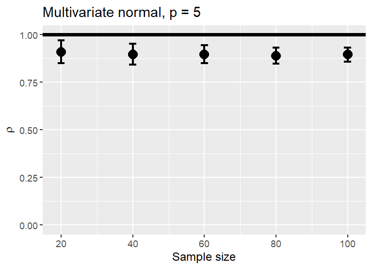
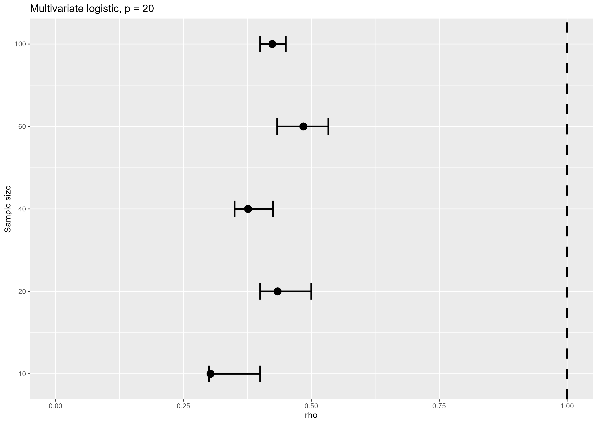
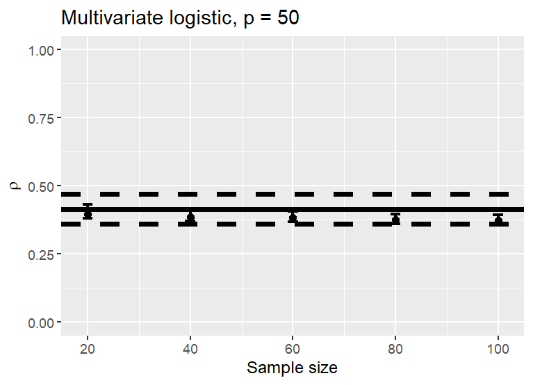
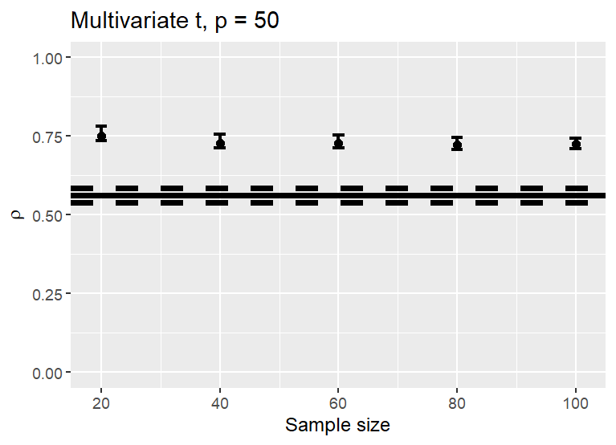
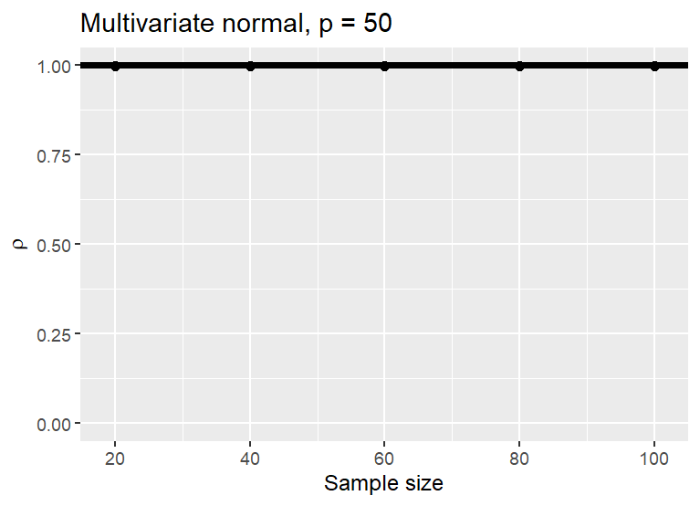

- I work as a biostatistician at the University of Oulu School of Medicine.

```{r out.width='100%', fig.height=6, eval=require('leaflet'), echo=FALSE}
library(leaflet)
leaflet() %>%
  addTiles() %>%
  setView(25.23685, 62.58855,  zoom = 4.5) %>%
    addMarkers(c(25.5242, 24.9495), c(65.0075, 60.1696), label = c("My workplace", "We are here"))
```

--

- My research interests are (not limited to) high-dimensional statistic, non-parametric methods, statistical tests and rejection sampling.

--

- Here I will introduce a novel multivariate test that also works in high-dimensional case.

---

class: center, middle

# Background and motivation

---

# Background and motivation

- All parametric statistical methods built on assumptions about the the distribution of the random variable.

--

- In multivariate applications dealing high-dimensional data assume the population distribution is multivariate normal.

--

  - Gaussian Graphical Models. If not normal `->` strict conditional-independence interpretation becomes weaker.

--

  - High-dimensional linear discriminant analysis. If not normal `->` other methods such as RF or SVMs may be more robust alternatives.

---

# Background and motivation

- $H_0: f = f_0$

--

- For example, $H_0: f\text{ is a multivariate normal distribution.}$

--

- Several test have been proposed (e.g., Kolmogorov–Smirnov, energy test by Székely and Rizzo (2005), a high-dimensional test by Chen, H & Xia (2023) and many others)

--

- Until we have a test that can detect the difference in 100% power in every single scenario, this is still an open research problem...

---

class: center, middle

# The AR statistic

---

# The AR statistic

- Based on the Accept-Reject (AR) algorithm.

--

$$\rho = \frac{1}{n}\sum_{i=1}^n \text{I}\Bigl(\frac{f_0(X_i)}{Df(X_i)} > U\Bigr).$$

--

- $\rho$ is the proportion of observations $X_i$, among $n$ observations drawn from a distribution with density $f$, that would be accepted as samples from the distribution with density $f_0$.

---

# The AR statistic

- The algorithm was adapted in Kuismin (2026) for statistical inference.

--

- Main idea: 

--

- Let $f$ be the true density (population density) and $f_0$ is the hypothesized density.

--

- Compute $\rho$ under null: Assume that $f_0$ and $f$ are the same distribution (set the normalizing constant $D = 1$).

--

- Instead of generating pseudo random numbers from $f$, compute $\rho$ with respect to the observed data. 

---

# The AR statistic

Technical challenges:

--

- $f$ is unknown (naturally) and we only have observations from it. How to determine $f$?

--

`->` Estimate $f$, e.g., using KDE(...)

--

- $\rho$ depends on an external random variable $U$. How to determine a deterministic test statistic?

--

`->` Use $E_U(\rho)$ instead.

--

- Denote $\rho(\textbf{X}) = E_U(\rho) = n^{-1}\sum_{1=1}^n \min\left(1, f_0(X_i)/\widehat{f}(X_i)\right)$.

---

# The AR statistic

The statistic has several attractive properties.

--

Direct probabilistic interpretation:

--

- The AR statistic can be interpreted as an estimated acceptance probability.

--

It measures how often observations would be accepted under the hypothesized population distribution. 

--

- Values close to 1 indicate good agreement with the hypothesized distribution.

- Values close to 0 indicate lack of fit and evidence against the model.

--

Interval estimates for $\rho(\textbf{X})$ can be computed using simulations or Poisson-Binomial distribution.

---

# The AR statistic

It is a global measure of distributional agreement

--

- It can detect differences in location, covariance, tail behavior, skewness, multimodality, and other shape features.

--

The statistic is connected to *total variation distance*.

- It measures similarity between the true density $f$ and the hypothesized density $f_0$.

---

# Distribution of the test statistic

- The population distribution is multivariate uniform distribution, independent variables, $p = 10$.

- Approximate the distribution of the test statistic by running the AR algorithm multiple times and compare it with the PoissonBinomial distribution.

- The black vertical line illustrates the 1 - TVD between multivariate normal and multivariate uniform distribution, approximated using Monte Carlo integration.

```{r message=FALSE, warning=FALSE, echo = FALSE, out.width='100%', fig.height=3}
set.seed(1)

source("functions/compute_multivariate_tvd.R")

p = 5

Sigma = diag(1, p)
mu = rep(0, p)

N = c(100, 120, 150)

M = 10^5

i = 1

Q2 = data.frame()

par(mfrow = c(1, 3), 
    cex.axis=1.5,
    mar = c(5.1, 5.1, 4.1, 2.1))

for(n in N){
  
  x = NonNorMvtDist::rmvunif(n = n,
                             dim = p)
  
  fhat = Rfast2::kernel(x)
  
  rhox = mvtnorm::dmvnorm(x)/fhat
  
  rhox[is.na(rhox)] = 0
  
  rhox = ifelse(rhox > 1, 1, rhox)
  
  rho = mean(rhox)
  
  U = matrix(runif(n*M), n, M)
  
  f = function(x) rhox > x
  
  I = apply(U, 2, f)
  
  d = colMeans(I)
  
  a = table(d)/M
  
  a = as.numeric(names(a))
  
  plot(table(d)/M, 
       type = "h",
       xlab = expression(rho),
       #ylab = "Probability",
       ylab = " ",
       main = paste0("n = ", n),
       lwd = 4,
       cex.lab = 2,
       col = "darkgray",
       xaxt = "n",
       xlim = c(0, 0.15))
  
  axis(1,
       at = a,
       labels = as.character(round(a, 2)))
  
  xx = 0:n
  
  probpb = poibin::dpoibin(xx, pp = rhox)
  
  lines(xx/n + 0.002, 
        probpb, 
        type = "h", 
        lwd = 4, 
        col = rgb(red=0, green=0, blue=1, alpha=0.5))
  
  abline(v = rho, lty = 2, lwd = 4, col = "red")
  
  if(i == 1){
   tvd_u = compute_multivariate_tvd(p=p) 
  }
  
  abline(v = 1 - tvd_u, lwd = 3)
  
  i = i + 1
  
}
```

---

# Total variation distance

The total variation distance (TVD) between $f(x)$ and $f_0(x)$ is defined as 

$$\|f(x) - f_0(x)\|_{\text{TV}} = \frac{1}{2}\int_{\mathcal{X}}|f(x) - f_0(x)|\, dx.$$
Then, as $n \to \infty$,

$$\rho(\textbf{X}) \xrightarrow{P} 1 - \|f(x) - f_0(x)\|_{\text{TV}},$$
where $f$ is the true density (population density) and $f_0$ is the hypothesized density.

- See Kuismin (2026) for more detailed description and proof.

---

# Total variation distance

## TVD - multivariate logistic

--



--

- Multivariate logistic distribution, $p=5$, location vector $\mathbf{0}$, and variance matrix $\mathbf{I} = diag(1, \ldots, 1)_{5 \times 5}$.

---

# Total variation distance

## TVD - multivariate t

--



--

- Multivariate t distribution, $p=5$, location vector $\mathbf{0}$, and variance/scale matrix $\mathbf{I} = diag(1, \ldots, 1)_{5 \times 5}$.

---

## TVD - multivariate normal

--



--

- Multivariate normal distribution, $p=5$, location vector $\mathbf{0}$, and variance matrix $\mathbf{I} = diag(1, \ldots, 1)_{5 \times 5}$.

---

# Challenges 

- The statistic depends on a density estimate $f$.

--

`->` Estimating $f$ is more or less hopeless in high-dimensional setting.

--

- However, let's test how well $\rho(\textbf{X})$ works when making decision whether to reject $H_0$ or not.

---

class: center, middle

# Going beyond the limit

---

# Going beyond the limit

- Although density estimation becomes unfeasible when $p \gg n$ and $p$ increases, can we still get something useful?

--

- How does the AR statistic hold up?

--

- For comparison, the energy test statistic cannot be computed when $p > n$,

```{r warning=FALSE}
n = 40
p = 50
mu = rep(0, p)
I = diag(1, p)
x = mvtnorm::rmvnorm(n = n,
                     mean = mu,
                     sigma = I)
energy::mvnorm.test(x, R = 500)
```

---

# Going beyond the limit



---

## TVD examples - multivariate logistic

--


---

## TVD - multivariate t

--



---

## TVD - multivariate normal

--



---

# References

Chen, H & Xia, Y. (2023). A Normality Test for High-dimensional Data Based on the Nearest Neighbor Approach, Journal of the American Statistical Association,
118, 719-731, https://doi.org/10.1080/01621459.2021.1953507

Kuismin, M. (2025). Using the rejection sampling for finding tests. arXiv preprint arXiv:2509.10325.

Székely, G. J. & Rizzo, M. L. (2005). A new test for multivariate normality. Journal of Multivariate Analysis 93, 58-80, https://doi.org/10.1016/j.jmva.2003.12.002

---

class: center, middle

# Thanks!

Slides created via the R package [**xaringan**](https://github.com/yihui/xaringan).

(Something a bit different for Beamer presentations.)
